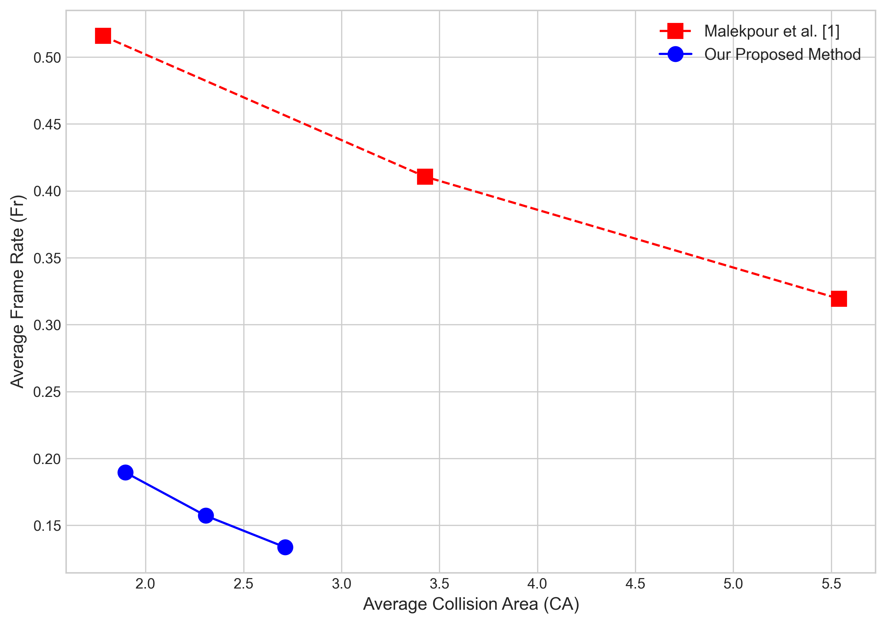

# Breaking the Synopsis Trade-off: Preserving Event Cohesion via Community-Aware Graph Packing

This repository contains the official implementation for the paper "[Your Paper Title Here]". Our work introduces a novel framework for video synopsis that significantly improves both summarization efficiency and the narrative coherence of the final video.

Unlike traditional methods that often create chaotic summaries by arranging objects based solely on individual importance, our approach models the video content as a heterogeneous graph. By identifying and preserving "communities" of interacting objects, we generate a synopsis that is not only compact but also logically and visually coherent.

## Methodology Highlights
Our pipeline consists of several key stages:
- **Dynamic Preprocessing:** Includes adaptive background generation, robust tracklet merging using visual features (ResNet-50), and intelligent data cleaning.
- **Heterogeneous Graph Modeling:** Objects and their complex spatio-temporal and visual interactions are modeled using a rich heterogeneous graph.
- **GNN-based Importance Scoring:** A Graph Attention Network (GAT) is trained to learn context-aware importance scores for each object.
- **Community-Aware Packing:** A novel packing algorithm that uses the detected communities (events) and their GNN scores to schedule objects, preserving the narrative flow.
- **Advanced Evaluation:** We introduce a new metric, the Community Cohesion Ratio (CCR), to quantitatively measure the narrative coherence of a synopsis.

## Experimental Results
Our method was evaluated on the **SynoClip** dataset and compared against state-of-the-art techniques. The results demonstrate a significant performance leap, simultaneously improving both the **Frame Rate (Fr)** and the **Collision Area (CA)**, effectively breaking the traditional trade-off between compression and visual quality.



*Comparison of our method (blue) against the state-of-the-art (red), averaged over five videos. The ideal point is the bottom-left corner.*

## Dataset
The experiments in this paper were conducted on the **SynoClip** dataset, a public benchmark introduced by Malekpour et al. in their 2024 paper, "A Low-Computational Video Synopsis Framework with a Standard Dataset".

You can download the full SynoClip dataset from the original source linked below:

* **Download SynoClip Dataset:** [[SynoClip Dataset](https://drive.google.com/drive/folders/14rqDbwsedevmk6n_ZCFfRzw-ofq-wGi0?usp=drive_link)]


## Setup & Installation

To run this project, first clone the repository and install the required dependencies.

```bash
git clone https://github.com/Hosein541/Community-Aware-Video-Synopsis.git
cd Community-Aware-Video-Synopsis
pip install -r requirements.txt
```

## How to Run
The entire pipeline is contained within the main Jupyter Notebook.

1.  Download the dataset and place the videos in your working directory.
2.  Open the `main_pipeline.ipynb` notebook.
3.  In the first code cell, set the `video_path` to your desired input video and choose a `densification_factor`.
4.  Run all cells in the notebook in order. The final video synopsis and all evaluation results will be generated and saved in the project folder.

## Citation
If you find this work useful in your research, please consider citing our paper:

```bibtex
@article{yourname2025breaking,
  title={Breaking the Synopsis Trade-off: Preserving Event Cohesion via Community-Aware Graph Packing},
  author={Your Name, and Co-author Names},
  journal={arXiv preprint arXiv:your-arxiv-id},
  year={2025}
}
```
